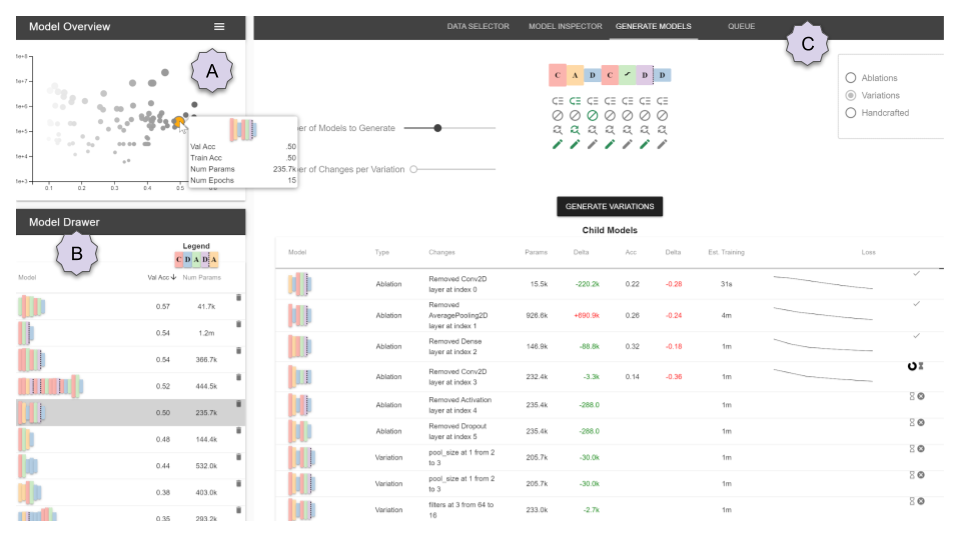

# Rapid Exploration of Model Architectures and Parameters

## Overview

This repository contains the code for REMAP, or "Rapid Exploration of Model Architectures and Parameters", a research application used to rapidly explore the space of convolutional neural networks in a semi-automated Neural Architecture Search.

This project is part of an academic work to be published in IEEE Transactions on Visualization and Computer Graphics in 2020, and presented at the IEEE Conference on Visualization in Vancouver, BC.

The authors of this work are Dylan Cashman, Adam Perer, Remco Chang, and Hendrik Strobelt.  Dylan and Remco are from Tufts University in Medford, MA, Adam is from Carnegie Mellon University in Pittsburgh, PA, and Hendrik is from the MIT IBM Watson AI Lab in Cambridge, MA.

The accompanied paper can be found at xxxxx.

If you find this work useful in an academic project, please cite it.

`
@article{}
`

## Quick start

REMAP uses two servers; a frontend server, which serves static assets via webpack, and a backend server, written in Flask, which handles requests to generate new models and train them.  

### Installation

The front end can be installed using a javascript package manager.  From within the `webapp` folder, install packages using either `yarn` or `npm install`.

The backend can be installed using `pip`.

First, you have to have `python3.6` installed.  We recommend installing it with `virtualenv`.  

From within the `pytorch_optimizer` folder, install the requirements.  Assuming `pip` is pointed to your `python3.6`, 

    pip install -r requirements.txt

This may take some time, as it has to install `torch` and `torchvision`.

### Downloading Quickdraw Data

**The Quickdraw dataset is too large to include in the repo**.  However, it is freely available via the `googlecreativelab` github repo.  **A subset of the dataset must be downloaded into the `pytorch_optimizers/optimizers/data/` folder.**

[https://github.com/googlecreativelab/quickdraw-dataset/blob/master/README.md#numpy-bitmaps-npy](https://github.com/googlecreativelab/quickdraw-dataset/blob/master/README.md#numpy-bitmaps-npy)

There is no programmatic API to download it, so we cannot include a script, but if you download the following `.npy` files into this directory, the rest of the application should work.

    full_numpy_bitmap_apple.npy
    full_numpy_bitmap_face.npy
    full_numpy_bitmap_moustache.npy
    full_numpy_bitmap_mouth.npy
    full_numpy_bitmap_nose.npy
    full_numpy_bitmap_octopus.npy
    full_numpy_bitmap_pear.npy
    full_numpy_bitmap_pineapple.npy
    full_numpy_bitmap_umbrella.npy
    full_numpy_bitmap_wine bottle.npy

### Running the servers

From two different terminals, run both servers.  

In one terminal, run the webapp by changing into the `webapp` directory, and then `npm run serve`.

In the other terminal, you need to run the flask app.  Change into the `pytorch_optimizer/optimizers/` folder.  Then, on a Unix-based system:

    FLASK_APP=model_trainer.py flask run

On a Windows system:

    set FLASK_APP=model_trainer.py
    flask run

The web application should be running at `localhost:8080`, and it should be connecting to the backend over `localhost:5000`.  You may have to refresh the page.

## Generating Your Own Data

The code above uses a set of pre-generated models available in the repository.  To replicate the full end-to-end process described in the paper, you may want to generate your own models.  This is possible via scripts in the `pytorch_optimizer/optimizers/` folder.  

### Usage

There are three scripts used to generate data.  They should all be run from the `pytorch_optimizer/optimizers` root folder.

	usage: random_mas.py [-h] [--model_dir MODEL_DIR]
                     [--accuracy_file ACCURACY_FILE]
                     [--mast_data_file MAST_DATA_FILE] [-v] [--cuda] [-n N]
                     [--epochs EPOCHS] [--data_dir DATA_DIR]

`random_mas.py` runs a random search, generating sequential convolutional networks as a Markov process with static probabilities defined in `random_cnn_generator.py`.  Feel free to add layers or change transition probabilities.  `data_dir` is the path where CIFAR-10 will get downloaded to.  `model_dir` will save the individual model information.  `accuracy_file` is a .csv file containing validation accuracies per model.  `mast_data_file` contains the JSON data needed for use with MAST.

	usage: hyperband_mas.py [-h] [-v] [--cuda] [-R R] [--eta ETA]
	                        [--data_dir DATA_DIR]
	                        [--mast_data_file MAST_DATA_FILE]
	                        model_dir accuracy_file

`hyperband_mas.py` functions similarly, but runs the Hyperband optimizer to decide how long to train various models.  See [Hyperband: A Novel Bandit-Based Approach to Hyperparameter Optimization](https://arxiv.org/abs/1603.06560).

**NOTE** that this process saves all models that are generated, and some can be several MB large.  This means it will very rapidly take up a lot of storage.  Plan accordingly.

Lastly, the MetaQNN algorithm, from [Designing Neural Network Architectures using Reinforcement Learning](https://arxiv.org/abs/1611.02167), was also tested in our accompanying publication.  This data was generated via a fork of the authors' repository.  The fork can be found at [https://github.com/dylancashman/metaqnn](https://github.com/dylancashman/metaqnn).

### Adding your own optimizer logic

You can modify the existing optimizer logic and transition probabilities in `random_cnn_generator.py`, or you can add your own optimizer script, following the example of the existing optimizers.

## Contributing

Feel free to fork this project and use it in your own work, adherent to the attached license.  If you have questions, please post an issue on this Github repository.

## Special Thanks

Special thanks to Evan Phibbs from the MIT IBM Watson AI Lab, Subhajit Das from Georgia Tech, and Kirthevasan Kandasamy from UC Berkeley for both helpful ideas as well has helpful code snippets.

## License

REMAP is released under the ApacheLicense, Version 2.0.

Licensed under the Apache License, Version 2.0 (the "License");
you may not use this file except in compliance with the License.
You may obtain a copy of the License at

    http://www.apache.org/licenses/LICENSE-2.0

Unless required by applicable law or agreed to in writing, software
distributed under the License is distributed on an "AS IS" BASIS,
WITHOUT WARRANTIES OR CONDITIONS OF ANY KIND, either express or implied.
See the License for the specific language governing permissions and
limitations under the License.
